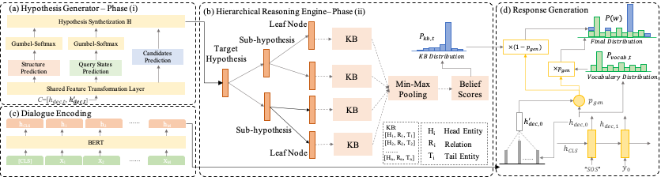

# NS-Dial

This is the code repository for the paper:
**An Interpretable Neuro-Symbolic Framework for Task-Oriented Dialogue Generation**. ***ACL 2022***. 


## Framework
<table>
    <tr>
        <td ><center> </center></td>
    </tr>
</table>


## Dependencies
* Pytorch 1.0.0
* cudatoolkit 10.0.130
* cudnn 7.6.5
* tqdm 4.54.1
* numpy 1.19.2
* python 3.6.10


## Training
We created `train.py` to train the models. For SMD dataset, you can run:
```console
python train.py -ds=kvr -bsz=8 -hdd=128 -lr=0.001 -dr=0.2 -evalp=10 -max_neg_cnt=5 -max_depth=3
```
For MultiWOZ 2.1 dataset, you can run:
```console
python train.py -ds=multiwoz -bsz=8 -hdd=128 -lr=0.001 -dr=0.2 -evalp=10 -max_neg_cnt=5 -max_depth=3
```
While training, the model with the best validation results is stored. If you want to reuse a model, please add `-path=path_name_model` to the call. The model is evaluated by BLEU and Entity F1.


## Testing
We created `test.py` to restore the checkpoints and test the models. For SMD dataset, you can run:
```console
python test.py -path=<path_to_saved_model> -ds=kvr -lr=0.001 -dr=0.2 -max_depth=3
```
For MultiWOZ 2.1 dataset, you can run:
```console
python test.py -path=<path_to_saved_model> -ds=multiwoz -lr=0.001 -dr=0.2 -max_depth=3
```
